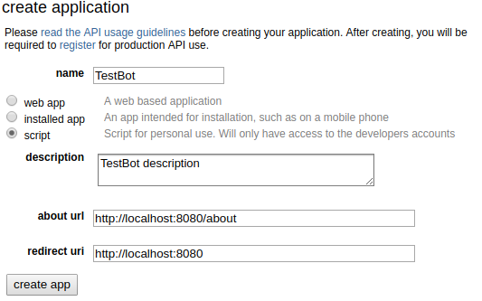
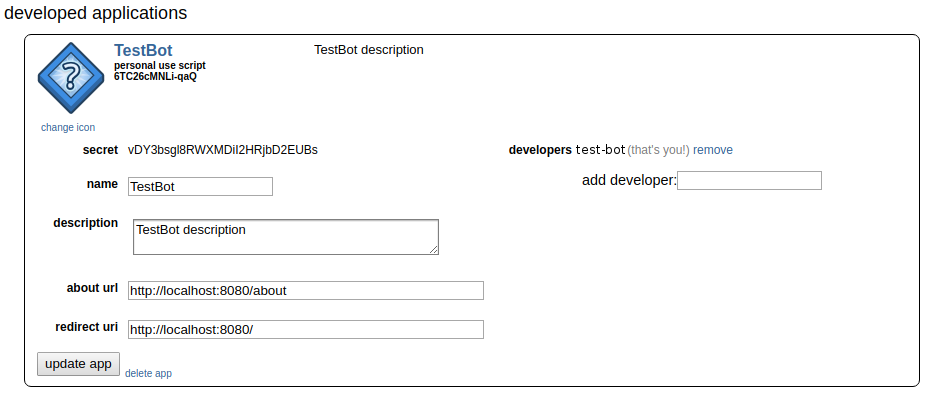

.. _setup:

Bot Account Setup
=================

To instantiate a :class:`praw.Reddit` instance, you need to provide a few login credentials. If you
have not done so already, go to https://www.reddit.com/prefs/apps and click the `create a new app` button.
This should pop up the following form:

After filling out the inputs and pressing `create app`, you will see a new application in the list above:

With the information in this box it is now possible to create a :class:`praw.Reddit` using the following parameters:

:client_id: The `personal use script` listed in the application box.
:client_secret: The `secret` listed in the application box.
:username: Username of the bot reddit account.
:password: Password of the bot reddit account.
:user_agent: User agent description, e.g. :code:`Script by u/testbot`. See also the `reddit api-rules <https://github.com/reddit/reddit/wiki/API#rules>`_.

For the above example, a reddit instance can be created as follows:

.. code:: python

    import praw
    reddit = praw.Reddit(client_id='6TC26cMNLi-qaQ',
                         client_secret='vDY3bsgl8RWXMDil2HRjbD2EUBs',
                         password='botpassword',
                         user_agent='Script by u/test-bot',
                         username='test-bot')

Check out `Authenticating via OAuth <http://praw.readthedocs.io/en/latest/getting_started/authentication.html#>`_
in the PRAW documentation for further details.
